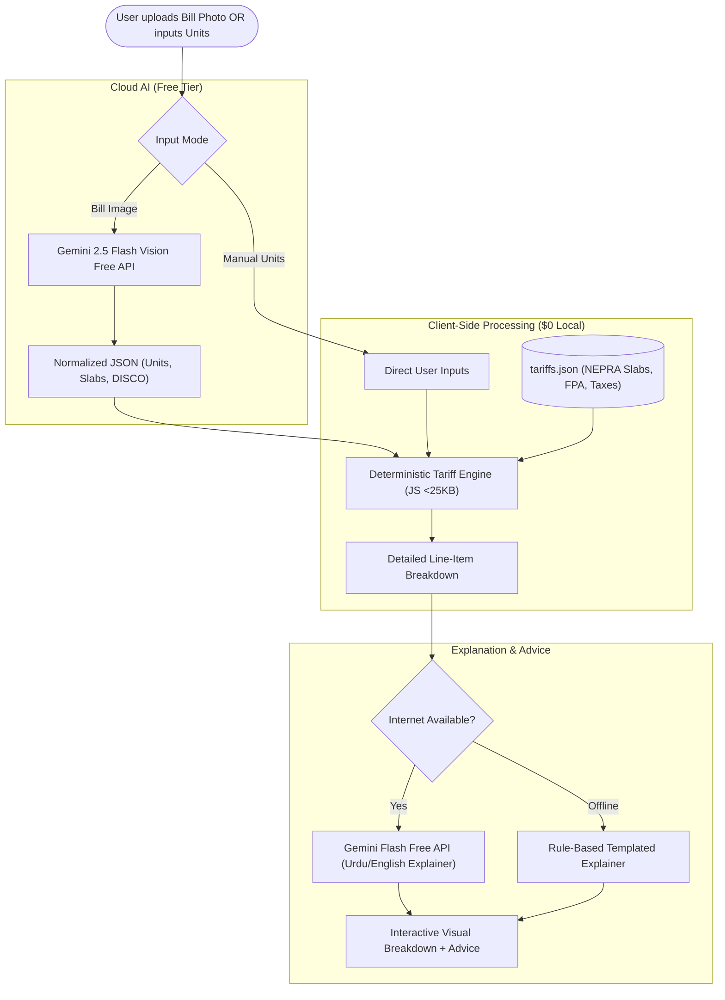

# ⚡ Bijli Ustad (Pakistan Market)

> **Category:** Fintech / Consumer Utility / Local RAG & Bill Explainer  
> **Target Audience:** Pakistani households, small businesses, and solar net-metering consumers (LESCO, K-Electric, IESCO, MEPCO, GEPCO, FESCO, PESCO, etc.)  
> **Budget:** Strictly **$0.00** (Free tiers, 100% client-side execution, zero backend database)  
> **Quality Standard:** Anti-Slop (Impeccable UI + Tabular Numerals) & Ponytail Minimalism

---

## 📖 Overview

Pakistani electricity bills have become notoriously confusing and unpredictable. Bills are rarely just `Units × Rate` — they encompass shifting protected/unprotected slab thresholds, Peak vs. Off-Peak time-of-use tariffs, Fuel Price Adjustments (FPA), Quarterly Tariff Adjustments (QTA), Financing Cost (FC) surcharges, Electricity Duty, GST, and TV fees. Furthermore, solar net-metering consumers struggle to decipher bidirectional export/import billing, peak unit surcharges, and credit rollover adjustments.

**Bijli Ustad** is a lightweight, zero-cost, privacy-first web application that breaks down any Pakistani electricity bill into plain language, Roman Urdu, and Urdu Nastaliq, explaining exactly *why* the bill surged and providing an official duplicate bill fetcher and grounded local RAG assistant.

---

## 🌟 Key Features

1. **Comprehensive Connection Coverage:**
   - **Single-Phase Domestic:** Protected consumer status tracking (<200 units for 6 consecutive months) and unprotected progressive slabs (1–100, 101–200, 201–300, 301–700, 700+ units).
   - **Three-Phase (Domestic & Commercial):** Separate peak and off-peak hour rate engines with sanctioned load fixed charges.
   - **Solar Net-Metering:** Bi-directional meter reconciliation (Import vs. Export units), peak/off-peak settlement, and billing credit rollovers.
2. **Dual Input Methods:**
   - **Bill Photo OCR (Cloud AI):** Upload a photo or duplicate screenshot; Google Gemini 2.5 Flash Free Vision extracts units, DISCO, and line items.
   - **Manual Mode (Local & Instant):** Enter units and connection type directly for instant calculation with zero network overhead.
3. **Transparent Line-Item Breakdown:**
   - Visual proportion of pure electricity generation cost vs. Government taxes and surcharges.
   - Plain-language explanation for cryptic charges: "What is FPA of Rs. 3,450 this month?", "Why did you lose protected status?".
4. **Actionable Consumption Advice:**
   - Precise threshold alerts (e.g. *"You consumed 204 units. Staying under 200 units would have saved you Rs. 4,200 due to unprotected slab penalties"*).
5. **Official Duplicate Bill Fetching:**
   - Direct integration links with official PITC DISCO portals and K-Electric using the 14-digit Reference Number or Consumer ID.
6. **100% Privacy & Offline Capability:**
   - Bill images are never saved to any database.
   - Deterministic tariff engine runs entirely inside the browser runtime without sending data to servers.

---

## 🏛️ System Architecture

---

## 🥊 Market Comparison: Why This App Wins

| Dimension | Existing Market Apps (Roshaan Bill Apps, Play Store WebViews, KE Live) | Bijli Bill Explainer |
|---|---|---|
| **Primary Function** | Only fetch duplicate PDF bills from DISCO websites. | **Explains what each charge means and why your bill spiked.** |
| **Slabs & Penalties** | None. Displays raw numbers without context. | **Detects protected status loss, slab penalties, and FPA arrears.** |
| **Solar Net-Metering** | Zero support for bidirectional meter accounting. | **Full import/export settlement and peak-hour adjustment math.** |
| **Ad Clutter & Privacy** | Riddled with aggressive banner and popup ads; stores tracking IDs. | **Zero ads, zero trackers, zero cloud database. 100% private.** |
| **Language** | Cluttered English or broken machine translations. | **Plain English, Roman Urdu, and proper Noto Nastaliq Urdu.** |

---

## ⚡ Lightweight & $0 Optimization Strategy

1. **Client-Side Image Downsampling:** Bill photos taken on mobile cameras (10–20MB) are resized via HTML5 Canvas to `< 300KB` before calling Gemini Vision, minimizing upload latency on slow 3G/4G connections.
2. **Zero Server Costs:** Hosted on GitHub Pages / Cloudflare Pages. No backend server or cloud database required.
3. **Deterministic Math Engine:** NEPRA slab calculation engine is pure JavaScript weighing `< 25KB`.
4. **PWA Offline Support:** Once cached by the Service Worker, manual calculation and rule-based explanations work without internet access.

---

## 🎨 Anti-Slop & Ponytail Minimalism

- **No AI Aesthetic:** No purple/indigo gradient themes, no oversized empty padding, and no generic cards. Styled with tabular numerals (`font-variant-numeric: tabular-nums`) for currency figures and high-contrast, thumb-friendly targets.
- **Ponytail Ladder:** Standard browser Canvas for breakdown charts instead of heavy charting libraries. Native numeric inputs with step controls. Co-located logic with zero unnecessary abstraction layers.

---

## 📁 Project Documents

- [RULES.md](file:///e:/Projects/Project%20Ideas/projects/01-bijli-bill-explainer/RULES.md) — Project-specific quality, domain, and privacy rules.
- [EXECUTION-PLAN.md](file:///e:/Projects/Project%20Ideas/projects/01-bijli-bill-explainer/EXECUTION-PLAN.md) — Phased development roadmap (Phases 0 through 5).
- [TEST-CASES.md](file:///e:/Projects/Project%20Ideas/projects/01-bijli-bill-explainer/TEST-CASES.md) — 53 test cases covering tariff engine, vision OCR, UI/UX, and performance.
